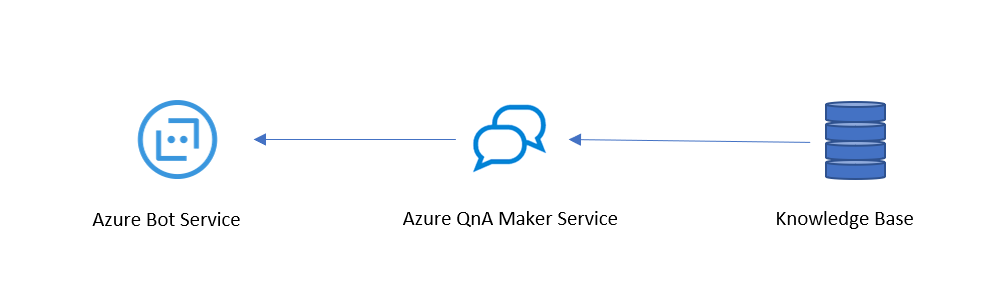
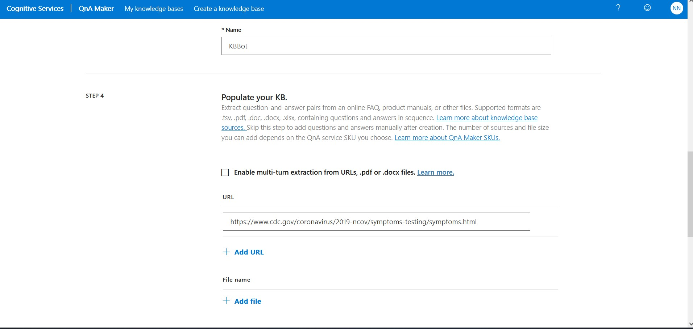
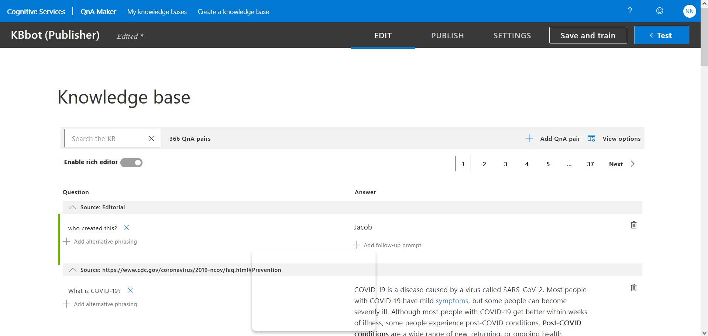
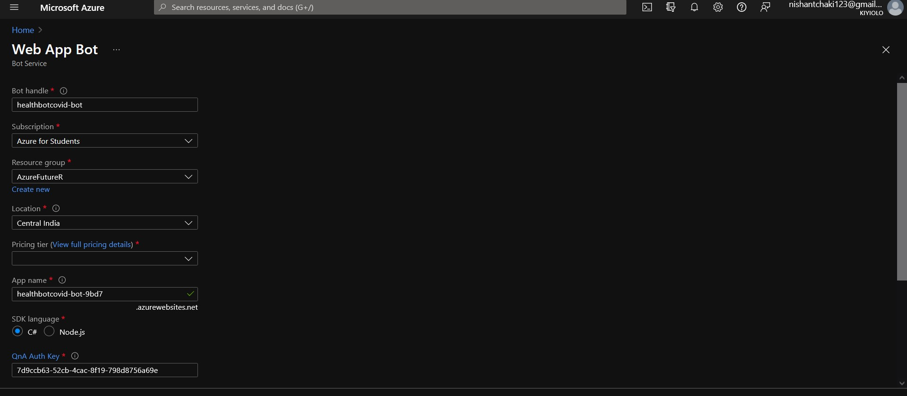
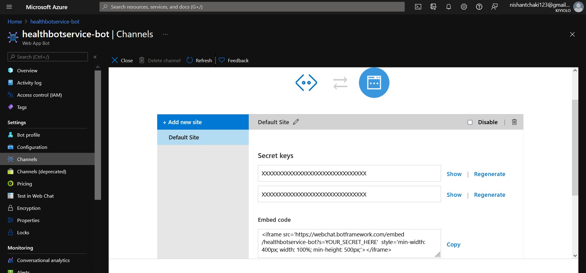
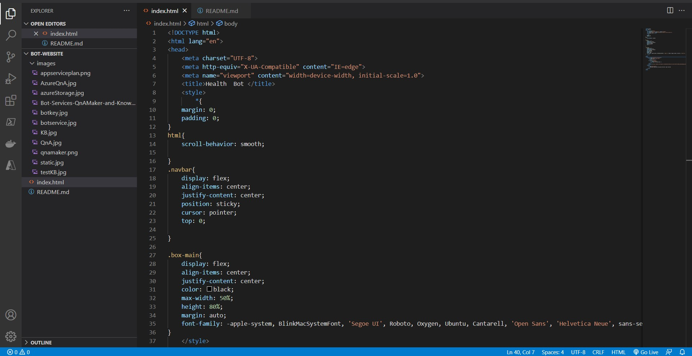
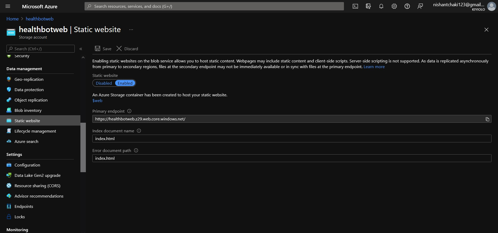

 ## Azure ChatBot service For immediate(Covid-19) Health Enquiry 

## Overview

## Problem Statement
Increase in demand for health service and  enquiry about Covid19 has produce overhead for healthcare professionals and Customer service workers.Customer service, covid helpline and Hospital helpline were overwhelmed during this pandamic. Many people called helpline to enquire about covid which made created overwhelm ,which made people searching for emergency services difficult.  Website for health service could include health bots which would reduce this overhead. Advantage is that  In general it would make easiler for end users to search for covid norms ,book vaccine and so on.
Medical chatbots would help by reducing hospital visits, reducing unnecessary treatments and procedures, and decreasing hospital admissions and readmissions as treatment compliance and knowledge about their symptoms improve. For patients, this comes with a lot of benefits: less time spent commuting to the doctor’s office less money spent on unnecessary treatments and tests easy access to the doctor at the push of a button.
People can easily search for queryor book an appointment  just by chatting with the bot.

## Project Description

The Project intregates simple bot which is made with QnA Maker in a static website  which help end users to equire about covid-19 related information.

 

The following resources needs to be configured :

   Azure Components | Description
   -----------------|------------
     Azure QnA Maker  | QnA Maker is a no code way to build bots
    Azure Bot Service | Azure Bot Service is a managed bot development service.
     Storage Account  | An Azure storage account contains all of your Azure Storage data objects : blobs, file shares, queues, tables, and disks. 

Following  components are provisioned in resource Group: AzureFutureR.

  * Azure Application Insights
  * Search service
  * App Service Plan
  * QnA maker
  * Azure bot service
  * Storage account

Azure Application Inaights is been added which can monitor Azure cloud service apps for availability, performance, failures, and usage by combining data . It would be necessary  for monitoring multiple web app services which host this bot. 

## Setting up the Environment

*QnA Maker*
1. Create Azure resource from create resource and navigate to QnA Maker 
2. Choose Free pricing tier, select appropaite location for App Service Plan, Azure search and Also enabled App insight  for Telemetry and chatlogs which  will be stored here.
   
 

 3. Go to view Resource and navigate to Quick start and go to QnA Portal.
 4. Add appropaite details and fill the knowledge base

5. Press Create.
6. With Knowledge base editor we  add new sets of QnA or Configure the questions.
7. We navigate to *save and train* to save the changes.

8. We Publish the Bot by navigating to publish.

To Publish we need Azure bot service. QnA portal will redirect to create Web App For Bot (Azure bot service) which will host the bot and provide  tools for deployment services. We either create a new service or link a exisiting service.

*Azure Bot Service*
1. We create a azure bot service from Azure portal.

2. In Azure Bot Service Under settings we go to channels copy the embeded code and secrete  and replace 'YOUR_SECRET_HERE' in embed code with secret key and paste in html file.

 (Code:iframe src='https://webchat.botframework.com/embed/healthbotservice-bot?s=YOUR_SECRET_HERE'  style='min-width: 400px; width: 100%; min-height: 500px;'></iframe> )

  
## Creating website to host Azure Bot

1. Create an html file and the embed code with secret key

*Storage Account*
1.   Again we navigate to storage account from Azure portal and create storage account.

2.   In Storage Account Under Data Management we go Static webiste enable it. we add document name to *index.html* referring to our website html file and Save it.

We successfully hosted our website
 

Link: https://healthbotweb.z29.web.core.windows.net/

## Summary

With Azure QnA Maker, Azure QnA Maker and Azure Storage Static web hosting, we have configured a chatbot service which has capability to answer covid-19 related questions. 
